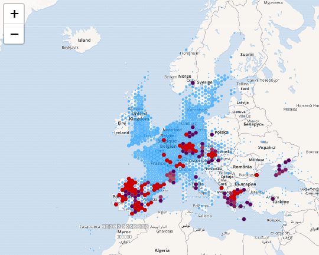

# BiCIKL-Hackathon
Documentation of our work during the BiCIKL Hackathon

- [BiCIKL-Hackathon](#bicikl-hackathon)
    - [NB: These are the multiplication symbols in Unicode](#nb-these-are-the-multiplication-symbols-in-unicode)
  - [GBIF Occurences](#gbif-occurences)
    - [VASCAN - Database of Vascular Plants of Canada](#vascan---database-of-vascular-plants-of-canada)
  - [Parsing Hybrid Formulas](#parsing-hybrid-formulas)
    - [Detecting Hybrid Formulas](#detecting-hybrid-formulas)
  - [Parsing Hybrid Formulas](#parsing-hybrid-formulas-1)
    - [Splitting out the parents](#splitting-out-the-parents)
    - [pivoting](#pivoting)
  - [Plotting Hybrid Parents](#plotting-hybrid-parents)
  - [GBIF Checklists](#gbif-checklists)

### NB: These are the multiplication symbols in Unicode
* U+00D7 × Multiplication sign (HTML &#215; · &times;) - This is the most common hybrid indictor used
* U+2715 ✕ Multiplication X (HTML &#10005;)
* U+2716 ✖ Heavy Multiplication X (HTML &#10006;)
* U+2A09 ⨉ N-ARY TIMES OPERATOR (HTML &#10761;)
* U+2A2F ⨯ VECTOR OR CROSS PRODUCT (HTML &#10799; · &Cross;)

## GBIF Occurences

1. Taxonomic names were extracted from GBIF occurences using the following SQL script.

`CREATE TABLE 
tim.names 
row format delimited fields terminated by '\t'
AS
SELECT
  v_scientificnameid , 
  v_acceptednameusageid , 
  v_parentnameusageid , 
  v_originalnameusageid , 
  v_nameaccordingtoid , 
  v_namepublishedinid , 
  v_taxonconceptid , 
  v_scientificname , 
  v_acceptednameusage , 
  v_parentnameusage , 
  v_originalnameusage , 
  v_higherclassification , 
  v_kingdom , 
  v_phylum , 
  v_class , 
  v_order , 
  v_family , 
  v_genus , 
  v_subgenus , 
  v_specificepithet , 
  v_infraspecificepithet , 
  v_taxonrank , 
  v_verbatimtaxonrank , 
  v_scientificnameauthorship , 
  v_vernacularname , 
  v_taxonremarks , 
  scientificname , 
  acceptednameusage , 
  parentnameusage , 
  originalnameusage , 
  nameaccordingto , 
  namepublishedin , 
  namepublishedinyear , 
  higherclassification , 
  kingdom , 
  phylum , 
  class , 
  order_ , 
  family , 
  genus , 
  subgenus , 
  specificepithet , 
  infraspecificepithet , 
  kingdomkey , 
  phylumkey , 
  classkey , 
  orderkey , 
  familykey , 
  genuskey , 
  subgenuskey , 
  specieskey , 
  species , 
  genericname , 
  acceptedscientificname ,   
  typifiedname 
FROM prod_h.occurrence
WHERE basisOfRecord = 'PRESERVED_SPECIMEN' 
AND kingdomKey=6
GROUP BY 
  v_scientificnameid , 
  v_acceptednameusageid , 
  v_parentnameusageid , 
  v_originalnameusageid , 
  v_nameaccordingtoid , 
  v_namepublishedinid , 
  v_taxonconceptid , 
  v_scientificname , 
  v_acceptednameusage , 
  v_parentnameusage , 
  v_originalnameusage , 
  v_higherclassification , 
  v_kingdom , 
  v_phylum , 
  v_class , 
  v_order , 
  v_family , 
  v_genus , 
  v_subgenus , 
  v_specificepithet , 
  v_infraspecificepithet , 
  v_taxonrank , 
  v_verbatimtaxonrank , 
  v_scientificnameauthorship , 
  v_vernacularname , 
  v_taxonremarks , 
  scientificname , 
  acceptednameusage , 
  parentnameusage , 
  originalnameusage , 
  nameaccordingto , 
  namepublishedin , 
  namepublishedinyear , 
  higherclassification , 
  kingdom , 
  phylum , 
  class , 
  order_ , 
  family , 
  genus , 
  subgenus , 
  specificepithet , 
  infraspecificepithet , 
  kingdomkey , 
  phylumkey , 
  classkey , 
  orderkey , 
  familykey , 
  genuskey , 
  subgenuskey , 
  specieskey , 
  species , 
  genericname , 
  acceptedscientificname ,   
  typifiedname `
  
  2. The verbatim names from `v_scientificname` , `v_acceptednameusage` , `v_originalnameusage` were merged together into a single long list
  3. Names from this long list where extracted in batches
  * Names with `=` in seemed to be hybrid formulas with hybrid names e.g. `Amaranthus x ozanonii Thell. in Asch. & Graebn. (=A. hybridus L.x A. retroflexus L.)`
  * These names can be found in file hybridnamesWithHybridFormulasFromOccurences.txt
  4. These names were then parsed with the script of @PietrH
  5. This script identified the names that were hybrid formulas and those that were not, the latter are mostly hybrid names (e.g. `Symphytum ×uplandicum`)
  6. With the hybrid names, after harmonization of the `x` `×` `X` and `✕` and the removeal of the space before the epithet, the first two words were taken and a unique list of hybrid names was creates. These can be found in file hybridnamesFromOccurences.txt

### VASCAN - Database of Vascular Plants of Canada
The Database of Vascular Plants of Canada contains uniform hybrid formulas. These were used as a first test set to develop the hybrid formula parsing script from. Downloaded the dataset from `DOI:10.5886/zw3aqw` 

Citation: Brouillet L (2020). Database of Vascular Plants of Canada (VASCAN). Version 37.9. Université de Montréal Biodiversity Centre. Checklist dataset https://doi.org/10.5886/zw3aqw accessed via GBIF.org on 2021-09-23. 

Output at [data/vascan_hybrid_names.txt](data/vascan_hybrid_names.txt)

## Parsing Hybrid Formulas

Script here: https://github.com/PietrH/1-lost_parents/blob/main/src/parsing_hybrid_formulas.R

### Detecting Hybrid Formulas

First created R function to detect if a string was likely a hybrid formula. 

Currently the function looks like this:
```
 ## check if it's a hybrid formula ------------------------------------------
is_hybrid_formula <- function(taxon_name, hybrid_delimiter = ' x | X | × | ×') {
  
  # check length of input (currently one at a time please)
  if (length(taxon_name) > 1) {
    stop(sprintf("taxon_name has length %i, should be only 1", length(taxon_name)))
  }
  
  ## taxon_name cleaner code
  
  taxon_name_clean <- 
    stringr::str_remove_all(taxon_name,"\\?") %>% 
    trimws()
    
  # split into parts 
  parts <- stringi::stri_split_regex(taxon_name_clean, pattern = hybrid_delimiter) %>% unlist
  
  # check if there is more than one part
   return(stringi::stri_count_words(parts[[1]]) > 1)
}
```

It splits the input string by a set of delimiters, then it removes leading and trailing whitespace and all questionmarks, splits into parts by the delimiter and checks the length. 

## Parsing Hybrid Formulas

After filtering out everything that's not a hybrid formula, I've attempted to split them into their parents (2 or more, but if more then 2 the order of crossing is not taken into account at all). These parents are then looked up in the gbif taxonomic backbone, as we can use the GBIF species ID to remove duplicates (synonyms etc..) later on. 


We used this script to iterate over the [GBIF Occurences](#gbif-occurences) datasets created via SQL.

### Splitting out the parents
Splitting into parents based on the delimiter, and then propagating the (abbriviated) genus name trough the hybrid formula to help out the gbif taxonomic backbone parser out.

Current state of the code:

```
get_parents <- function(taxon_name, delimiter = ' x | X | × | ×') {
  parents <-
    taxon_name %>%
    # stri_split_fixed(delimiter) %>%
    stri_split_regex(delimiter) %>%
    unlist()
  # return a dataframe with gbif taxonomic backbone matches for the parents
  
  if (any(stri_count(parents, fixed = " ") < 1)) {
    genus <-
      stri_split_boundaries(parents[1], type = "word") %>% unlist %>% .[[1]]
    
    parents <- c(parents[1], paste(genus, parents[2:length(parents)]))
  }
  
  # if the taxon names don't have a space, assume they are of the same genus as the first one
  
  
  # if the second parent starts with a single capital letter followed by a
  # period, and this letter is the same letter as the first word of the first
  # parent, then replace this letter and period with the first word of the first
  # parent (the genus)
  
  if (all(
    isTRUE(stri_detect_regex(parents[2], "^[A-Z]{1}\\.")),
    isTRUE(stringr::str_extract(parents[1], "[A-Z]{1}") == stringr::str_extract(parents[2], "[A-Z]{1}")),
    isTRUE(length(parents) == 2)
  )) {
    parents[2] <-
      stri_replace_all_fixed(
        str = parents[2],
        pattern = stri_extract(parents[2], regex = "^[A-Z]{1}\\."),
        replacement = stri_extract_all_boundaries(parents[1], type = "word")[[1]][1]
      )
  }
  
  
  
  map_dfr(parents, rgbif::name_backbone)
  
}
```

### pivoting
We then pivot the API return so it's nicer in the output. 

```
get_parents_pivoted <- function(hybrid_formula, delimiter) {
  parents <- get_parents(hybrid_formula, delimiter) %>%
    # filter(!is.na(scientificName)) %>%
    mutate(., parent = letters[1:nrow(.)])

  spec <- parents %>%
    build_wider_spec(., names_from = parent, values_from = names(.))


  # get_parents(hybrid_formula,delimiter) %>% mutate(parent = c("A","B")) %>%
  parents %>%
    pivot_wider_spec(spec) %>%
    mutate(hybrid_formula = hybrid_formula) %>%
    select(
      hybrid_formula,
      starts_with("usageKey"),
      starts_with("scientificName"),
      starts_with("rank"),
      starts_with("confidence")
    )
}

```

## Plotting Hybrid Parents
Looking up the occurrences from the hybrid parents from [Parsing Hybrid Formulas](#parsing-hybrid-formulas) in GBIF, and then plotting them on maps using leaflet (also GBIF maps API) and convex hull range mapping (also using GBIF occurrence API)

https://github.com/PietrH/1-lost_parents/blob/main/src/plotting_parents_on_map.R

An example for `Veronica hederifolia x triloba` (in red) interpreted as parent_a `Veronica hederifolia L.` (in blue) and parent_b `Veronica triloba (Opiz) A.Kern.` (in purple)



## GBIF Checklists

GBIF checklists allow for `nameType == HYBRID`, Pieter and Marina collaborated in creating a script to query the GBIF species API and filtering the resulting checklist out to only contain plants. 

Script: https://github.com/PietrH/1-lost_parents/blob/main/src/getting_hybrids_from_checklists_gbif.R

Output: [data/2021-09-22_12-00_gbif_checklist_hybrids.csv](data/2021-09-22_12-00_gbif_checklist_hybrids.csv)


